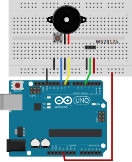

# Software PDG!

Software product development game

## Install

You will need:

* A pushbutton that grounds `BUTTON_PIN`
* A piezo speaker connected between `PIEZO_PIN` and ground
* A WS2812 strip having `LED_COUNT` RGB LEDs connected to `STRIP_PIN`

Find all those constants in a section marked _Commissioning Parameters_ in the `.ino` file.

Here is a picture that should work with the default values.

